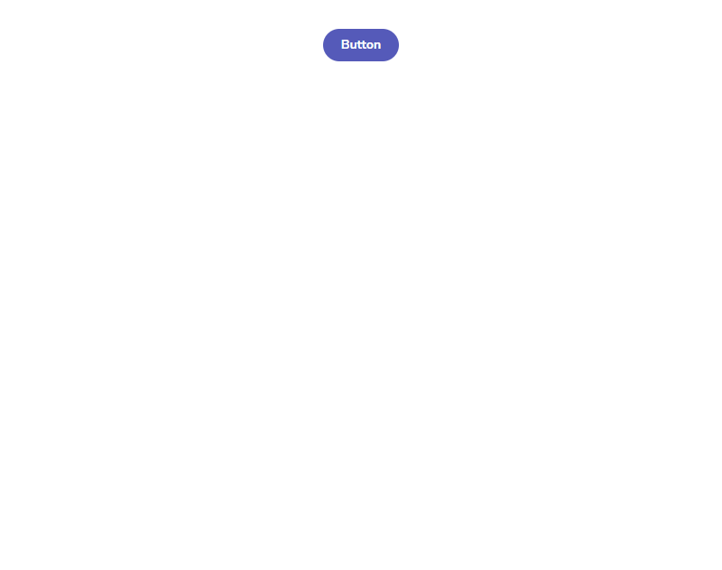
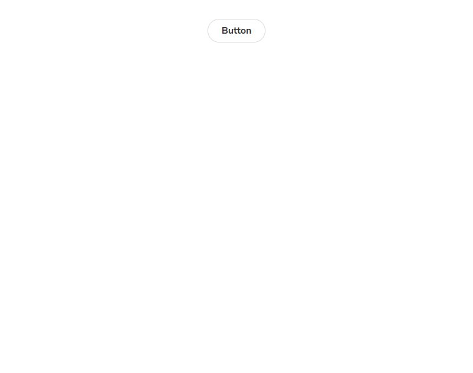
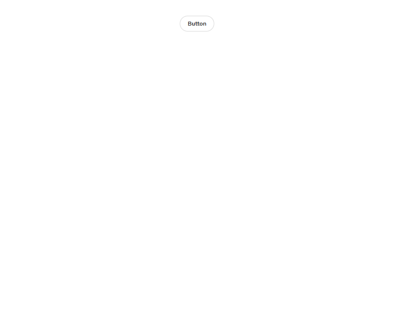

# Uzence Design Studio - UI Component Library

A professional React component library built with TypeScript, Tailwind CSS, and modern design principles. Features a comprehensive set of reusable UI components with built-in theming, accessibility, and responsive design.

## ✨ Features

- **🎨 Professional Design System** - Blue-gray color palette with semantic color tokens
- **🌙 Dark/Light Mode** - Complete theme switching with smooth transitions
- **♿ Accessibility First** - ARIA labels, keyboard navigation, and screen reader support
- **📱 Responsive Design** - Mobile-first approach with responsive breakpoints
- **🔧 TypeScript** - Full type safety and IntelliSense support
- **⚡ Modern Stack** - React 18, Vite, Tailwind CSS v4
- **📚 Storybook Integration** - Component documentation and testing
- **🧪 Component Variants** - Multiple styles, sizes, and states for each component

## 🚀 Quick Start

### Prerequisites

- **Node.js** 18.0 or higher
- **npm** or **yarn** package manager

### Installation

1. **Clone the repository**
```bash
git clone <repository-url>
cd "Uzence Design Studio"
```

2. **Install dependencies**
```bash
npm install
```

3. **Start the development server**
```bash
npm run dev
```

4. **Open your browser**
Navigate to `http://localhost:5174` to see the component demo.

## 📦 Available Scripts

| Command | Description |
|---------|-------------|
| `npm run dev` | Start development server with hot reload |
| `npm run build` | Build for production |
| `npm run preview` | Preview production build locally |
| `npm run lint` | Run ESLint for code quality |
| `npm run storybook` | Start Storybook development server |
| `npm run build-storybook` | Build Storybook for deployment |
| `npm run screenshots` | Generate component screenshots with Storycap |
| `npm run screenshots:build` | Generate screenshots from built Storybook |

## 🧩 Components

### InputField
Professional input component with multiple variants and features:
- **Variants**: `outlined`, `filled`, `ghost`
- **Sizes**: `sm`, `md`, `lg`
- **States**: `loading`, `disabled`, `error`
- **Features**: Password toggle, clear button, helper text

**[→ View InputField Stories](https://main--68a3d71292ba31a29325b31c.chromatic.com/?path=/story/ui-components-inputfield--default)**

<div align="center">


</div>

```tsx
<InputField
  label="Email Address"
  placeholder="Enter your email..."
  variant="outlined"
  size="md"
  invalid={hasError}
  errorMessage="Please enter a valid email"
/>
```

### DataTable
Feature-rich data table with sorting and selection:
- **Column sorting** (ascending/descending)
- **Row selection** (single/multiple)
- **Custom cell rendering**
- **Loading and empty states**
- **Responsive design**

**[→ View DataTable Stories](https://main--68a3d71292ba31a29325b31c.chromatic.com/?path=/story/ui-components-datatable--default)**

<div align="center">


</div>

```tsx
<DataTable
  data={users}
  columns={columns}
  selectable
  onRowSelect={setSelectedUsers}
  loading={isLoading}
/>
```

### Button
Versatile button component with multiple variants and smooth animations:
- **Variants**: `default`, `destructive`, `outline`, `secondary`, `ghost`, `link`
- **Sizes**: `default`, `sm`, `lg`, `icon`
- **Features**: Hover lift effects, active scale, smooth transitions

**[→ View Button Stories](https://main--68a3d71292ba31a29325b31c.chromatic.com/?path=/story/example-button--primary)**

<div align="center">




</div>

```tsx
<Button variant="default" size="md">
  Click me
</Button>
```

### Badge
Status and category indicators with hover animations:
- **Variants**: `default`, `secondary`, `destructive`, `outline`, `success`, `warning`
- **Features**: Hover scale effects, shadow animations

**[→ View Badge Stories](https://main--68a3d71292ba31a29325b31c.chromatic.com/?path=/story/ui-components-badge--default)**

```tsx
<Badge variant="success">Active</Badge>
<Badge variant="warning">Pending</Badge>
```

### ThemeToggle
Theme switching component with dropdown and animations:
- Light, dark, and system theme options
- Smooth transitions with rotation effects
- Persistent theme preference
- Icon scaling on hover

**[→ View Theme Toggle in Action](https://main--68a3d71292ba31a29325b31c.chromatic.com/)**

```tsx
<ThemeToggle />
```

## 🎨 Design System

### Color Palette
Professional blue-gray palette with semantic naming:

```css
/* Primary Colors */
--primary: 217 91% 60%;        /* Professional Blue */
--foreground: 215 25% 27%;     /* Text Color */
--background: 0 0% 100%;       /* Background */

/* Semantic Colors */
--success: 142 76% 36%;        /* Green */
--warning: 38 92% 50%;         /* Orange */
--error: 0 84% 60%;            /* Red */
--muted: 210 40% 96%;          /* Light Gray */
```

### Theme Structure
```
Light Mode → Dark Mode
--background: white → dark gray
--foreground: dark → light
--muted: light gray → dark gray
--border: light → dark
```

## 🛠️ Technology Stack

- **Framework**: React 18 with TypeScript
- **Build Tool**: Vite 7.x
- **Styling**: Tailwind CSS v4 with CSS custom properties
- **Component Variants**: Class Variance Authority (CVA)
- **Icons**: Lucide React
- **Documentation**: Storybook
- **Code Quality**: ESLint + TypeScript

## 📁 Project Structure

```
src/
├── components/
│   ├── ui/                    # Reusable UI components
│   │   ├── InputField.tsx     # Input component
│   │   ├── DataTable.tsx      # Table component
│   │   ├── button.tsx         # Button component
│   │   ├── badge.tsx          # Badge component
│   │   └── theme-toggle.tsx   # Theme switcher
│   └── ComponentDemo.tsx      # Demo showcase
├── hooks/
│   └── use-theme.tsx          # Theme management hook
├── lib/
│   └── utils.ts               # Utility functions
├── stories/                   # Storybook stories
└── index.css                  # Global styles & design tokens
```

## 🎯 Usage Examples

### Basic Setup
```tsx
import { ThemeProvider } from './hooks/use-theme';
import { ComponentDemo } from './components/ComponentDemo';

function App() {
  return (
    <ThemeProvider>
      <ComponentDemo />
    </ThemeProvider>
  );
}
```

### Custom Component
```tsx
import { InputField } from './components/ui/InputField';
import { Button } from './components/ui/button';

function LoginForm() {
  const [email, setEmail] = useState('');
  
  return (
    <form className="space-y-4">
      <InputField
        label="Email"
        type="email"
        value={email}
        onChange={(e) => setEmail(e.target.value)}
        placeholder="Enter your email"
      />
      <Button type="submit" className="w-full">
        Sign In
      </Button>
    </form>
  );
}
```

## 🌙 Theme Integration

The component library includes a complete theming system:

1. **ThemeProvider**: Wrap your app with the theme context
2. **useTheme**: Access theme state and controls
3. **CSS Variables**: Automatic color switching
4. **LocalStorage**: Persistent theme preference

```tsx
import { useTheme } from './hooks/use-theme';

function MyComponent() {
  const { theme, setTheme, actualTheme } = useTheme();
  
  return (
    <div>
      Current theme: {actualTheme}
      <button onClick={() => setTheme('dark')}>
        Switch to Dark
      </button>
    </div>
  );
}
```

## 🧪 Development

### Adding New Components
1. Create component in `src/components/ui/`
2. Use CVA for variant management
3. Include TypeScript interfaces
4. Add to ComponentDemo showcase
5. Create Storybook stories

### Styling Guidelines
- Use Tailwind CSS utilities
- Leverage CSS custom properties for theming
- Follow the existing color system
- Ensure accessibility (ARIA labels, focus states)
- Test in both light and dark modes

## 📚 Storybook

### Local Development
Access component documentation and interactive examples:

```bash
npm run storybook
```

Visit `http://localhost:6006` to explore components, their props, and usage examples.

### 🌐 Live Preview

**🚀 [View Live Storybook →](https://main--68a3d71292ba31a29325b31c.chromatic.com/)**

Explore all components interactively with live examples, props documentation, and theme switching.

**Deploy Options:**
- **Chromatic**: `npm run deploy:chromatic` (Recommended for teams)
- **Vercel**: `npm run deploy:vercel` (Fast and simple)

## 🤝 Contributing

1. Fork the repository
2. Create a feature branch: `git checkout -b feature/new-component`
3. Make your changes and test thoroughly
4. Ensure all components work in both themes
5. Submit a pull request

## 📄 License

This project is licensed under the MIT License - see the LICENSE file for details.

---

**Built with ❤️ by Uddeshya Prajapati**